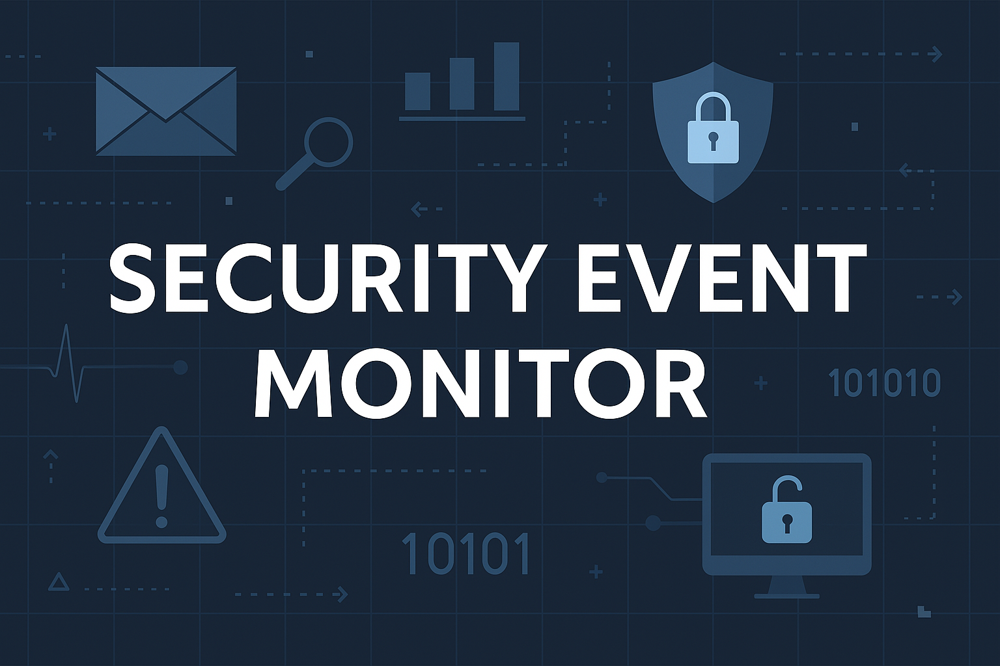

# 🐍 Python Bot for Windows Security Event Monitoring

This project is a lightweight Python-based tool to monitor and alert on critical Windows security events using Event Logs (`Security.evtx`).

## 🔐 Features

- ✅ Monitors key Event IDs:  
  - `4625` – Failed login  
  - `4672` – Privileged logon  
  - `4719` – Policy change
- 🔎 Filters by:
  - User (optional)
  - Source (optional)
  - Time window (in minutes)
- 📬 Sends alerts via:
  - Email (SMTP, TLS)
  - Telegram bot
- 🧠 Configurable via `config.json`
- 🪵 Logs to `security_events.log`

## 📦 Requirements

Install dependencies:
```bash
pip install -r requirements.txt
```

## ⚙️ Usage

1. Configure the `config.json` file (see example below)
2. Run the script:
```bash
python security_monitor.py
```

3. (Optional) Schedule it with Windows Task Scheduler for automation

## 🧾 Sample `config.json`

See the included file for reference.

## 👤 Author

Created by [Volodymyr Lisovyi](https://www.linkedin.com/in/volodymyr-lisovyi-66447649/)

## 📄 License

MIT License

# Main and Enhanced Versions of the Event Monitor

**This project contains two versions of the Security Event Monitor:**

1. **Main Version**:
   - Logs events and sends alerts via **Telegram**.
   - Uses PowerShell to monitor Windows Event Logs.
   - Simple configuration through `config.json`.

2. **Enhanced Version** (in the `enhanced/` folder):
   - Additional features: **Email notifications** via SMTP.
   - **CSV logging** for easy analysis in Excel or Power BI.
   - Improved **event filtering** and settings for more detailed configuration.

### 📂 How to Choose the Version:
- If you need the **basic version** of the security monitor, simply work with the main script and configuration.
- If you want **advanced features**, such as Email and CSV logging, refer to the folder [**`enhanced/`**](./enhanced/README.md).


